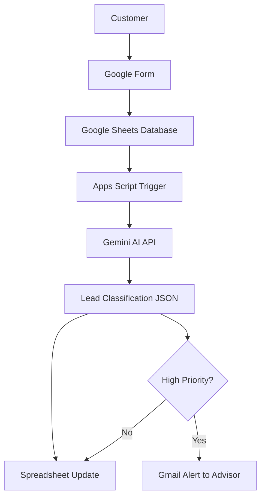

# System Diagram

This document visualizes the architecture of the **AI Cruise Inquiry Qualification System**.

The system automatically processes cruise inquiries submitted by customers, analyzes them using AI, enriches the data with classification results, and alerts advisors when high-priority inquiries are detected.

---

# Architecture Flow



---

# Component Explanation

## Customer

The workflow begins when a customer submits a cruise inquiry.

The inquiry typically includes:

- name
- email
- cruise preference
- destination
- travel period
- number of travelers
- additional message

This data represents the **raw lead input**.

---

## Google Form

Google Forms is used as the **input interface**.

Benefits:

- structured data collection
- easy deployment
- direct integration with Google Sheets

Each submission automatically creates a new row in the spreadsheet.

---

## Google Sheets Database

Google Sheets acts as the **central data storage layer**.

It stores:

Customer data:
- name
- email
- cruise preference
- destination
- travel period
- travelers
- message

AI classification results:
- inquiry_quality
- urgency
- cruise_type_classified
- travel_intent
- next_action
- ai_summary
- processed

This allows advisors to review inquiries with AI insights.

---

## Apps Script Trigger

Google Apps Script runs the automation logic.

Trigger configuration:

Function:
```
processLatestRow
```

Event Source:
```
From Spreadsheet
```

Event Type:
```
On Form Submit
```

This means the system activates **automatically whenever a new inquiry is submitted**.

---

## Gemini AI API

The Apps Script sends the inquiry data to **Google Gemini AI**.

Gemini receives:

- structured inquiry data
- classification instructions
- decision rules
- output schema

The AI analyzes the inquiry and produces a structured JSON response.

Example output fields:

- inquiry_quality
- urgency
- cruise_type_classified
- travel_intent
- next_action
- ai_summary

---

## Lead Classification

The AI evaluates the inquiry using rules such as:

High-quality inquiry indicators:

- destination provided
- travel period provided
- number of travelers
- cruise preference
- cabin preference
- request for offers

The system determines:

- lead quality
- urgency level
- cruise type
- booking readiness
- recommended next action

---

## Spreadsheet Update

The Apps Script writes the AI output back into the Google Sheet.

Example enriched row:

| Inquiry Quality | Urgency | Cruise Type | Travel Intent | Next Action |
|----------------|--------|-------------|--------------|-------------|
| high | medium | ocean | ready_to_book | send_offers |

This allows quick evaluation of incoming inquiries.

---

## Email Notification

If the AI detects a **high-value lead**, the system sends an automatic email alert.

Trigger condition:

```
inquiry_quality = high
AND
travel_intent = ready_to_book
```

The email includes:

- customer details
- travel preferences
- inquiry message
- AI classification results
- AI summary

This ensures travel advisors can respond quickly.

---

# End-to-End Data Flow

1. Customer submits inquiry via Google Form
2. Form writes data to Google Sheets
3. Apps Script trigger detects new submission
4. Inquiry is sent to Gemini AI
5. Gemini returns structured classification
6. Spreadsheet is updated with AI insights
7. Email alert is sent for high-priority leads

---

# Design Principles

The system is designed using several engineering principles.

### Event-driven automation
The workflow runs automatically when new data arrives.

### Structured AI output
The AI is constrained to produce valid JSON for reliable parsing.

### Data enrichment
Raw customer data is enhanced with AI-generated insights.

### Scalability
The system can process large numbers of inquiries without additional manual effort.

---

# Business Value

This system helps travel agencies:

- prioritize valuable leads
- reduce manual inquiry review
- improve response time
- standardize lead qualification
- support scalable sales operations

---

# Related Files

Project documentation is organized as follows:

```
docs/
    architecture.md
    system-overview.md
    system-diagram.md

scripts/
    apps-script.js

examples/
    sample-inquiry.md
    sample-output.md
```
